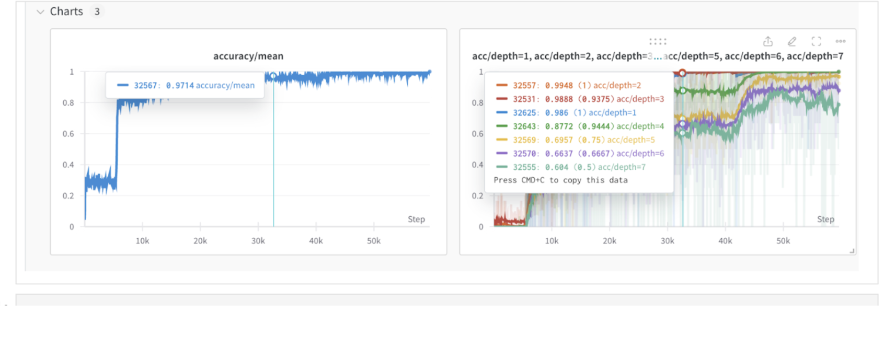

# reasoning-mech-interp

This work explores the use of a transformer model for navigating a toy symbolic reasoning task, specifically pathfinding in a binary trees.

This work is mostly a replication of **Mechanistic Analysis of a Transformer Trained on a Symbolic Multi-Step Reasoning Task**. ([arxiv](https://arxiv.org/pdf/2402.11917v2.pdf), [github](https://github.com/abhay-sheshadri/backward-chaining-circuits/tree/main))

## repo structure
 - `src/` contains core source code: training loop, data generation etc.
 - `notebooks/` contain experiment entry points and plots
 - `conf/` contains yaml files with hyperparameters.
 - `environment.yml` (too verbose) dump of my environment to enhance reproducibility

## wandb

Open wandb 🪄🐝 [project](https://wandb.ai/kilianovski/reasoning-mech-interp) with experiment logs

